# DTC Persona Analysis - a MLOps Pipeline
*MLOps infrastructure for customer persona analysis and segmentation mapping*

<!-- This project is a complete MLOps pipeline for creating customer personas for a Direct-to-Consumer (DTC) business. It uses a K-Means clustering model to segment customers based on their data. The entire environment is containerized with Docker Compose and uses modern MLOps tools for orchestration, experiment tracking, and data monitoring.-->

  <i>(fig. A: this is how I envisioned myself in long nights of coding)</i>

### First things first:
For the `MLOps Zoomcamp` evaluation, I made a brief guideline in the [evaluation.md](./evaluation.md) to help you navigate the project!  
I hope, it supports you!
 
 

### **TL;DR:**  
The `DTC Persona Analysis` repository provides a complete `MLOps infrastructure` to address a real-world customer segmentation challenge. This project demonstrates a production-ready machine learning pipeline that automatically classifies new customers into pre-existing marketing personas by matching their data to predefined cluster centroids, and includes monitoring to re-train and deploy a new model when the personas no longer match the incoming data.
   

### Deeper Dive
* [Problem Statement](problem_statement.md) - the general task   
* [Setup & Usage](setup.md) - the project setup and prediciton guideline  
* [Modelling](01_model/modelling_thoughts.md) - some thoughts about the modelling and the data design
   

### Core Objectives
- **Primary**: Develop a robust and automated classification model that assigns new customers to the most appropriate marketing persona based on proximity to provided persona centroids.
- **Secondary**: Implement a data monitoring system that tracks statistical distribution changes and triggers model re-training when data drift is detected.
   

### Technology Stack

| Category | Technology | Purpose |
| :--- | :--- | :--- |
| **Infrastructure** | Terraform, Google Cloud Storage (GCS) | Infrastructure as Code, Artifact Storage |
| **Containerization** | Docker, Docker Compose | Application Containerization & Stacking|
| **Data & ML Pipeline**| Mage, MLflow, Evidently AI | Orchestration, Experiment Tracking, Data Monitoring |
| **Database** | PostgreSQL, CloudBeaver | Data Storage, Model Registry, DB Management |
| **Model Serving** | Gunicorn, Python | API for real-time predictions |
| **Code Quality** | Black | Python Code Formatting |
| **Developer Tooling** | Pre-Commit hooks, Makefile | Automated pre-commit checks, Command runner for common tasks |  

### Architecture: Data Flow Diagram  

The diagram outlines the complete architecture of the project, from infrastructure provisioning to model serving.  
The diagram can be adapted easily via the mermaid code in `dfd.mermaid`, eg. in [Mermaid Flow](https://www.mermaidflow.app/editor)

### Core Features
*   **Containerized Environment:** All core services are orchestrated via **Docker Compose** for easy setup and consistent environments.
*   **Data Pipeline Orchestration:** **Mage** is used to manage the data transformation, model experiment tracking and data monitoring.
*   **Experiment Tracking:** **MLflow** is in pipeline and tracks experiments, logs models, and manages the model lifecycle.
*   **Data Drift & Monitoring:** **Evidently AI** is in pipeline to monitor for data drift, triggering model retraining when necessary.
*   **Model Deployment:** A production model is served via a containerized **Gunicorn** web service for real-time predictions.
*   **Infrastructure as Code (IaC):** Google Cloud Storage bucket is provisioned and managed using **HashiCorp Terraform**.
*   **Development:** Pre-Commit hooks ensure no private keys are exposed to GitHub and Makefile automates common tasks.  
*   **Database Management:**  
    - **PostgreSQL** serves as the backend for the MLflow Model Registry and stores customer data.  
    - **CloudBeaver** provides a web UI for easy database access.
   

### License
This project is licensed under the [MIT license](https://opensource.org/licenses/MIT).  

