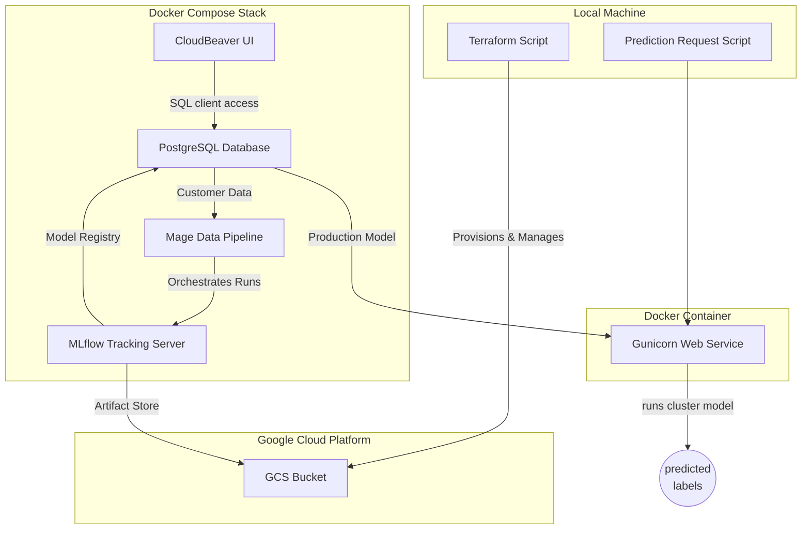

# dtc_persona_analysis
customer persona analysis and segmentation mapping

<!--

-->

## Problem Statement  
A company got their customer data clustered and uses this for the creation of personae used in marketing.
Newly acquired customers must be assigned to the most fitting cluster.

## Approach
Requirements are:
Select a dataset that you're interested in (see Datasets)
Train a model on that dataset tracking your experiments
Create a model training pipeline
Deploy the model in batch, web service or streaming
Monitor the performance of your model
Follow the best practices

- created mock data / clustering
- found best k for kmeans clustering with mlflow experiment tracking
- 

the data is anonymized based on a real-world scenario from a former market research project

good practices considered:
- pr-commit webhooks are used to check for large files and private keys not being commited
- 

- outlines are used in the jupyter notebooks for easier navigation

future steps:
- consider timezones in date creation
To revert your CLI to the previously installed version, you may run:
$ gcloud components update --version 427.0.0

gunicorn --bind=0.0.0.0:9999 --preload  --timeout 120 --log-file gunicorn.log gunicorn_predict:app

docker run -it --rm \
  --name gunicorn_webservice \
  -p 9999:9999 \
  -v "$(pwd)/gcp_key.json:/app/gcp_key.json" \
  -e GOOGLE_APPLICATION_CREDENTIALS="/app/gcp_key.json" \
  gunicorn_webservice:v1

  docker run -it --rm \
  --name gunicorn_webservice \
  -p 9999:9999 \
  gunicorn_webservice:v1

