# DTC Persona Pipeline
*Customer persona analysis and segmentation mapping*

<!-- This project is a complete MLOps pipeline for creating customer personas for a Direct-to-Consumer (DTC) business. It uses a K-Means clustering model to segment customers based on their data. The entire environment is containerized with Docker Compose and uses modern MLOps tools for orchestration, experiment tracking, and data monitoring.-->


### First things first:
For the MLOps Zoomcamp, I made a brief guideline in the evaluation.md ([click here](./evaluation.md)) to help you navigate the project evaluation! Hope, it helps ...

<!--
### Objective
With this project, I am re-creating a task I got as a market researcher back in the 2010s.  
At that time, I solved it with some self-written distance metrics in MS Excel.  
Now, I'm getting my hand at it again in quite a different tech stack ... :)
-->

### Problem Statement  
<!--
- One of the companies we conducted market research surveys for got their own customer base clustered by a third-party provider.
- The clusters were used for the creation of so-called personae, used in marketing based on their central demographics and consumer behavior.  
- Imagine these clusters as "Sustainable Steve": The Forward-Thinking Business Leader" or "Eco-Conscious Haley": The Affluent, Sustainable Lifestyle Adopter ... ;)
- The technical challenge: The clustering was done by a third-party provider, but we got asked to label our observations (basically every participant of our future own surveys) with one of the existing personae. 
- Like: "Is this new participant more Steve or more Haley or ...?"
- So we asked the other provider to forward us the demographic etc. features they clustered on, so we could also survey them.
- These are the features I exemplarily called x1, x2, ..., x10 in the mock dataset here.
- well and then, the next step is to design a model for newly collected data to label it. 
- This is what this project revolves around.
-->
```
TL;DR:  
This project builds a system to automatically label new customers with the a client's existing marketing personas. The model works by predicting the closest pre-defined persona centroid, and includes a monitoring to re-train and deploy a new model when the personas no longer match the incoming data.
````

1. Background & context  
A key client has segmented its customer base using a cluster analysis performed by a third-party provider. These clusters are the foundation of their core marketing personas (e.g., "Sustainable Steve," "Eco-Conscious Haley"). The mathematical definition for each persona is provided by a specific cluster centroid in a multi-dimensional feature space.

2. Core challenge  
The client has tasked us with building a system to classify new participants from our ongoing market research surveys into their pre-existing persona framework. The challenge is not to recreate the clustering, but to operationalize the labelling of new data points against the static, pre-defined cluster centroids provided by the original vendor.

3. Project objectives  
- Primary objective: To develop a robust and automated classification model that assigns new survey participants to the most appropriate marketing persona. The model's logic is based on calculating the proximity of a new data point to the provided persona centroids.
- Secondary objective: To implement a data monitoring system that tracks the statistical distribution of incoming survey data over time. This system will detect "data drift" and trigger a model re-training and deployment if the characteristics of new participants deviate significantly from the established persona definitions.  
*In real production ofc., a need for model retraining would trigger an alert to let decision makers re-evaluate the personas themselves.*

4. Data  
Core project assets we got provided (*in this project, since the original data is confidential, re-created with artificial data)*:
- Feature list: We have the definitive list of features (x1, x2, ..., x10) that define the persona space. These features will be incorporated into our survey instruments.
- Persona cluster centroids: We have received the numerical centroid for each persona. A centroid is a vector representing the mathematical average of all data points within a cluster, effectively serving as the "perfect example" or ideal center for that persona.  
*In this project, this is my ground truth for building new artificial data to be labelled.*

## Core Features
*   **Containerized Environment:** All core services are orchestrated via **Docker Compose** for easy setup and consistent environments.
*   **Data Pipeline Orchestration:** **Mage** is used to manage the data transformation, model experiment tracking and data monitoring.
*   **Experiment Tracking:** **MLflow** is in pipeline and tracks experiments, logs models, and manages the model lifecycle.
*   **Data Drift & Monitoring:** **Evidently AI** is in pipeline to monitor for data drift, triggering model retraining when necessary.
*   **Model Deployment:** A production model is served via a containerized **Gunicorn** web service for real-time predictions.
*   **Infrastructure as Code (IaC):** Google Cloud Storage bucket is provisioned and managed using **HashiCorp Terraform**.
*   **Database Management:** **PostgreSQL** serves as the backend for the MLflow Model Registry and stores customer data. 
    **CloudBeaver** provides a web UI for easy database access.

## Architecture: Data Flow Diagram  


The diagram outlines the complete architecture of the project, from infrastructure provisioning to model serving.  
The diagram can be adapted easily via the mermaid code in `dfd.mermaid` 

## Technology Stack

| Category | Technology | Purpose |
| :--- | :--- | :--- |
| **Infrastructure** | Terraform, Google Cloud Storage (GCS) | Infrastructure as Code, Artifact Storage |
| **Containerization** | Docker, Docker Compose | Application Containerization & Stacking|
| **Data & ML Pipeline**| Mage, MLflow, Evidently AI | Orchestration, Experiment Tracking, Data Monitoring |
| **Database** | PostgreSQL, CloudBeaver | Data Storage, Model Registry, DB Management |
| **Model Serving** | Gunicorn, Python | API for real-time predictions |
| **Code Quality** | Black | Python Code Formatting |
| **Developer Tooling** | Pre-Commit Hooks, Makefile | Automated pre-commit checks, Command runner for common tasks |  

## Setup and Installation

### Prerequisites

*   [Docker](https://www.docker.com/get-started) and [Docker Compose](https://docs.docker.com/compose/install/)
*   [Terraform](https://learn.hashicorp.com/tutorials/terraform/install-cli)
*   [Google Cloud SDK](https://cloud.google.com/sdk/docs/install) authenticated with your GCP account.
*   [Python](https://www.python.org/downloads/) 

### 1. Clone the Repository

```bash
git clone git@github.com:mmotl/dtc_persona_analysis.git
cd dtc_persona_analysis
```

### 2. Configure environment and environment variables

Create a `.env` file from the example template in the repository root.

```bash
cp .env.example .env
```

Now, edit the `.env` file and add your specific Google Cloud project details and any other required credentials.

```env
# .env file
GCP_PROJECT_ID="your-gcp-project-id"
GCP_REGION="your-gcp-region"
GCS_BUCKET_NAME="your-unique-gcs-bucket-name"
POSTGRES_USER="align_with_docker-compose"
POSTGRES_PASSWORD="align_with_docker-compose"
POSTGRES_DB="align_with_docker-compose"
```

Environment: Create a conda environment using the provided `environment.yml`:
```bash
conda env create -f environment.yml
```

Create a data subfolder
```bash
mkdir data
```

### 3. Provision Infrastructure

Use the `Makefile` to run Terraform and create the GCS bucket.

```bash
make tf_create
```

This will initialize Terraform and apply the configuration to create the necessary cloud resources.

### 4. Launch the Application Stack

Build and run all the services using Docker Compose.

```bash
cd 02_pipeline/mage-pipeline
docker-compose up --build -d
```

The `-d` flag runs the containers in detached mode. You can view logs using `docker-compose logs -f`.

## Usage

Once the stack is running, you can interact with the different components:

*   **Mage Pipeline UI:** `http://localhost:6789`
    *   Trigger new pipeline runs and monitor their status.
*   **MLflow Tracking UI:** `http://localhost:5050`
    *   View experiment runs, compare parameters/metrics, and manage registered models.
*   **CloudBeaver Database UI:** `http://localhost:8978`
    *   Access the PostgreSQL database. Use the credentials from your `.env` file.

### X. As soon as postgres runs, ingest artificial data into the database
To ingest a suitable dataset prepared, you can shortcut with `make` :
```bash
make create_data
```
The code runs via ingestion scripts with the following syntax. This is fyi only. No need to manually execute!
```bash
cd 00_create_data 
python create_data.py <number_of_samples> <std_dev> <random_seed> <month_of_timestamp> <filename.csv>  
python ingest.py <postgres_table_name_to_write_to> <filename.csv>
```

### X. Run pipeline with reference data to create initial model
### X. Start Web Service


### Running a Prediction

You can use the provided script to send a request to the prediction service.

```bash
cd /03_deployment
python test_gunicorn.py # this runs a test with 3 new observations to be labeled
```
<!-->
Alternatively, you can use `curl` to send a direct request to the Gunicorn web service:

```bash
curl -X POST -H "Content-Type: application/json" \
--data '{"customer_id": "123", "features": [0.1, 0.5, 0.9]}' \
http://localhost:8080/predict
```
-->

## Makefile Commands

A `Makefile` is included to simplify common tasks.

*   `make terraform_create`: Provisions the GCS infrastructure.
*   `make terraform_destroy`: Destroys the GCS infrastructure. **Use with caution.**
*   `make black`: Formats all Python code using the Black code formatter.
*   `make up`: Starts all services with `docker-compose up -d`.
*   `make down`: Stops all running services with `docker-compose down`.

## License

This project is licensed under the MIT License. See the [LICENSE](LICENSE) file for details.


[](https://opensource.org/licenses/MIT)
[](https://github.com/psf/black)
<!--[](https://github.com/) -->


### Approach
Requirements are:
Select a dataset that you're interested in (see Datasets)
Train a model on that dataset tracking your experiments
Create a model training pipeline
Deploy the model in batch, web service or streaming
Monitor the performance of your model
Follow the best practices

- created mock data / clustering
- found best k for kmeans clustering with mlflow experiment tracking
- 

the data is anonymized based on a real-world scenario from a former market research project


good practices considered:
- pr-commit webhooks are used to check for large files and private keys not being commited
- 

- outlines are used in the jupyter notebooks for easier navigation


future steps:
- consider timezones in date creation
To revert your CLI to the previously installed version, you may run:
$ gcloud components update --version 427.0.0

gunicorn --bind=0.0.0.0:9999 --preload  --timeout 120 --log-file gunicorn.log gunicorn_predict:app

docker run -it --rm \
  --name gunicorn_webservice \
  -p 9999:9999 \
  -v "$(pwd)/gcp_key.json:/app/gcp_key.json" \
  -e GOOGLE_APPLICATION_CREDENTIALS="/app/gcp_key.json" \
  gunicorn_webservice:v1

  docker run -it --rm \
  --name gunicorn_webservice \
  -p 9999:9999 \
  gunicorn_webservice:v1

In /data is pickled baseline model

