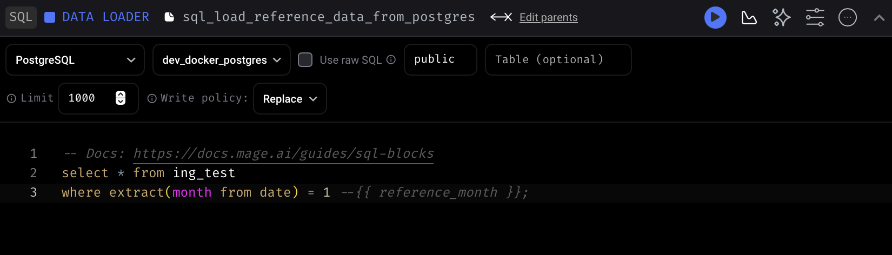
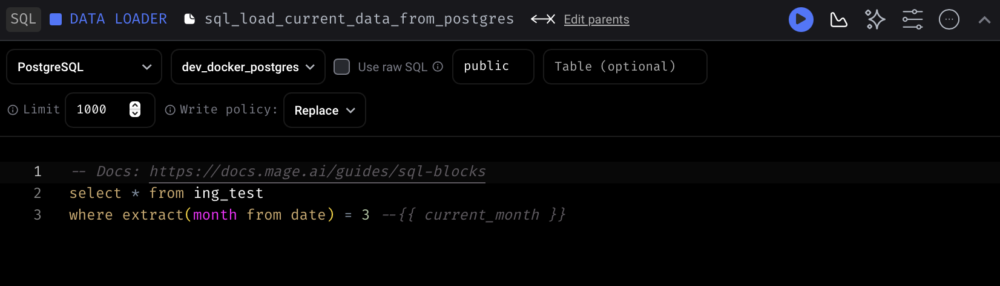
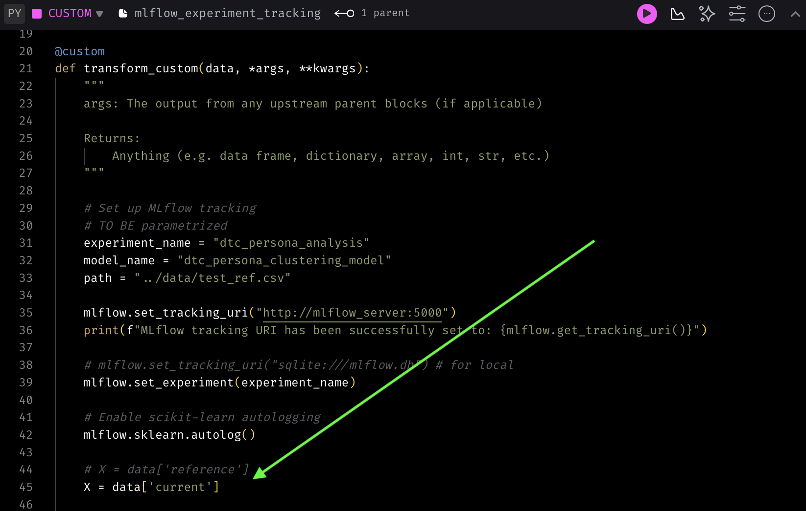

## Setup and Installation

### Prerequisites

*   [Docker](https://www.docker.com/get-started) and [Docker Compose](https://docs.docker.com/compose/install/)
*   [Python](https://www.python.org/downloads/)  
*   [Terraform](https://learn.hashicorp.com/tutorials/terraform/install-cli)
*   [Google Cloud access](https://cloud.google.com/sdk/docs/install) authenticated with your GCP account (for the MLflow artifact store)
*   [Telegram bot](https://gist.github.com/nafiesl/4ad622f344cd1dc3bb1ecbe468ff9f8a?permalink_comment_id=5404569): a bot token and a message id (for Evidently notifications)

### 1. Clone the Repository

```bash
git clone git@github.com:mmotl/dtc_persona_analysis.git
cd dtc_persona_analysis
```

### 2. Configure environment and environment variables

Create a `.env` file from the example template in the repository root.

```bash
cp .env.example .env
```

Now, edit the `.env` file and add your specific Google Cloud project details and any other required credentials.

```env
# .env file
GCP_PROJECT_ID="your-gcp-project-id"
GCP_REGION="your-gcp-region"
GCS_BUCKET_NAME="your-unique-gcs-bucket-name"
POSTGRES_USER="align_with_docker-compose"
POSTGRES_PASSWORD="align_with_docker-compose"
POSTGRES_DB="align_with_docker-compose"
BOT_TOKEN="your-telegram-bot-token"
CHAT_ID="your-telegram-chat-id"

```
To be on the safe side, duplicate the .env to the Mage pipeline folder (a step to take care of in a next iteration):
```bash
cp .env 02_pipeline/mage_pipeline/.env
```

Virtual environment:  
Create a conda environment using the provided `environment.yml`:
```bash
conda env create -f environment.yml -n <your_new_env_name>
```

Create a data subfolder
```bash
mkdir data
```

### 3. Provision Infrastructure

Use the `Makefile` to run Terraform and create the GCS bucket as an artifact store.  
*(Of course you can edit the docker-compose.yml and the necessary adaptions to only have a local artifact store,*. 
*get inspired by the [`docker-compose_local.yml`](./02_pipeline/mage-pipeline/docker-compose_local.yml) to only have a local artifact store!)*

```bash
make tf_create
```

This will initialize Terraform and apply the configuration to create the necessary cloud resources.

### 4. Launch the application stack

Build and run all the services using Docker Compose.

```bash
cd 02_pipeline/mage-pipeline
docker-compose up --build -d
```

The `-d` flag runs the containers in detached mode. You can view logs using `docker-compose logs -f`.

#### Usage

Once the stack is running, you can interact with the different components:

*   **Mage Pipeline UI:** `http://localhost:6789`
    *   Trigger new pipeline runs and monitor their status.
*   **MLflow Tracking UI:** `http://localhost:5050`
    *   View experiment runs, compare parameters/metrics, and manage registered models.
*   **CloudBeaver Database UI:** `http://localhost:8978`
    *   Access the PostgreSQL database. Use the credentials from your `.env` file.
    * Don't get fooled: When you run CloudBeaver for the first time, it wants you to set up admin credential. This is for the UI only. Just do it to be able to run queries and to access the schema.

### 5. As soon as postgres runs, ingest artificial data into the database
To ingest a suitable dataset prepared, you can shortcut with `make` :
```bash
make create_data
```
The code runs via ingestion scripts with the following syntax. This is fyi only. No need to manually execute!
```bash
#fyi only, no need to run!
cd 00_create_data 
python create_data.py <number_of_samples> <std_dev> <random_seed> <month_of_timestamp> <filename.csv>  
python ingest.py <postgres_table_name_to_write_to> <filename.csv>
#fyi only, no need to run!
```

### 6. Run pipeline with reference data to create initial model
* It's time to create a model for the reference data in Mage
* The mechanic is: 
    * The data ingested in postgres is data for January to April 2025, 500 customer observations each month. 
    * The data for January, February and April is not deviating from another, but there is a significant drift for the March data.
    * To trigger drift detection, and hence triggering the initial training of a model, January must be loaded as "reference" data and March as "current" data, like this:
    
    
    * Now you can choose in the custom block what dataset to use to train the model,  
    either the current data aor the reference data:
    

* So, the idea is - there is always the reference data from January and then there is follow-up data, February, March, ...
* February: nothing would happen, the data drift conditional would not trigger re-training.
* March: Evidently would notice data drift and the conditional would trigger the re-training of a model, of which the best run would be registered and promoted to production.
 
* *(There is a fallback pickled model in ```01_model/dtc_persona_clustering_model_v1/model/model.pkl```, just in case).*
### 7. Start Web Service
* You can start the Gunicorn web service with an endpoint to predict new persona labels based on customer features like this:
```bash
make gunicorn
```
#### Running a Prediction

Use the `parameterized` batch prediction script [03_deployment/batch_app_predict_from_db.py](batch_app_predict_from_db.py).  
It queries specified table for specified month/year data from the database based on the given parameters,  
sends features to the Gunicorn app for prediction,  
and writes prediction results back to the database in column `persona`:  

*Example: `python batch_app_predict_from_db.py 2025 4 customer_features`*  
(Have in mind the data in the database is from 01-2025 to 05-2025, with the `drifted fraction of the data in month 03-2025`)


```bash
cd 03_deployment
python batch_app_predict_from_db.py <year> <month> <table_name>
```


### And there we go. Happy predicting! :)